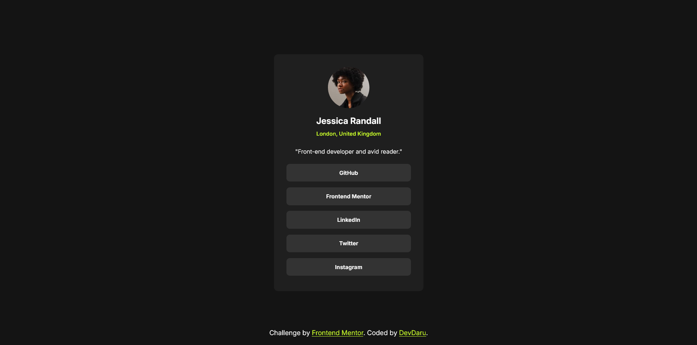

# Frontend Mentor - Social links profile solution

This is a solution to the [Social links profile challenge on Frontend Mentor](https://www.frontendmentor.io/challenges/social-links-profile-UG32l9m6dQ).

## Table of contents

- [Overview](#overview)
  - [The challenge](#the-challenge)
  - [Screenshot](#screenshot)
  - [Links](#links)
- [My process](#my-process)
  - [Built with](#built-with)
  - [What I learned](#what-i-learned)
  - [Continued development](#continued-development)
- [Author](#author))

## Overview

### The challenge

Users should be able to:

- See hover and focus states for all interactive elements on the page

### Screenshot

### Links

- Solution URL: [click here](https://github.com/DevvMarko/Social-Links-Profile)
- Live Site URL: [click here](https://devvmarko.github.io/Social-Links-Profile/)

## My process

### Built with

- Semantic HTML5 markup
- CSS custom properties
- Flexbox

### What I learned

I used transition effect in CSS to create simple animation on buttons hover. With that user see how website react on user interaction.

### Continued development

In next project I'll focus on add other simple animations, to mmake website faster and still looking good.

## Author

- Frontend Mentor - [@DevDaru](https://www.frontendmentor.io/profile/DevvMarko)
